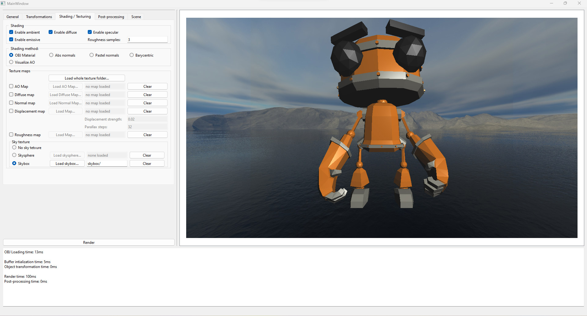
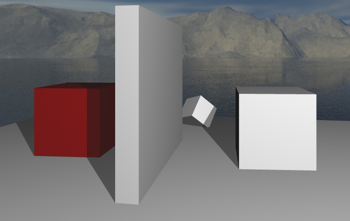
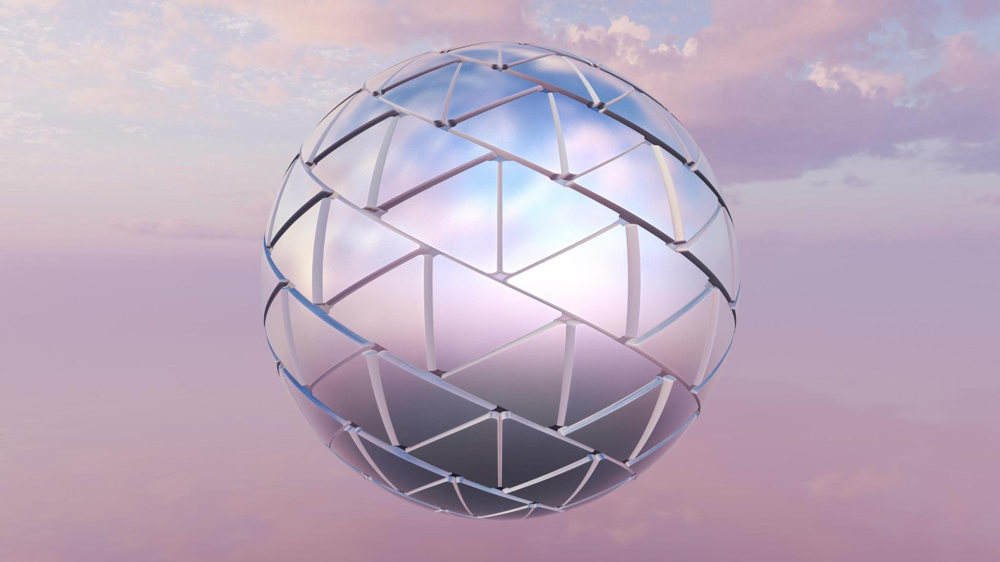
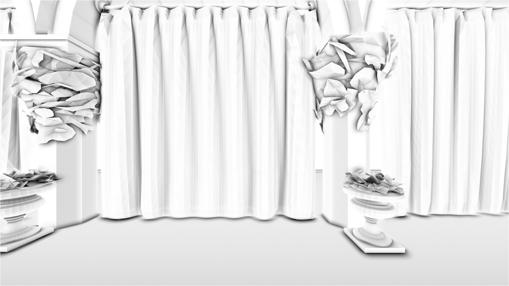
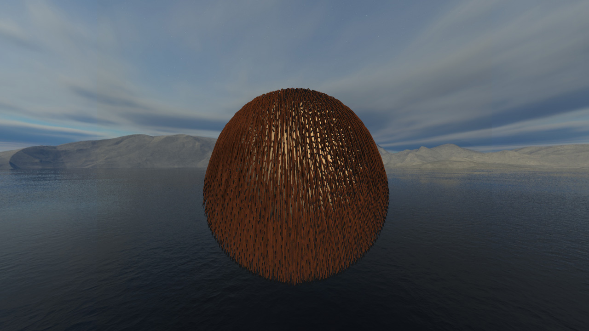

CPU ray-tracer + rasterizer entirely done in C++ and Qt6 for the interface.

Implemented features:

- Qt6 C++ Interface

- Ray tracing rendering
- Rasterization rendering
- Hybrid rendering (rasterization of the visibility + ray tracing for the shading)
- Clip-space clipping algorithme
- Hard shadows (shadow rays)

- Octree based BVH + 7 planes bounding volumes
- Rough reflexions (random ray cast around the normal)
- Normal mapping
- Diffuse texture, roughness map, ambient occlusion mapping
- Parallax occlusion mapping
- Skyspheres support

The mesh of the sphere is perfectly flat (analytic sphere). The perceived geometry is only due to the parallax mapping algorithm.
- Skyboxes support
- Super Sampling Anti Aliasing (SSAA)
- AVX2 Screen Space Ambient Occlusion (SSAO) implementation

- Hair modelisation

